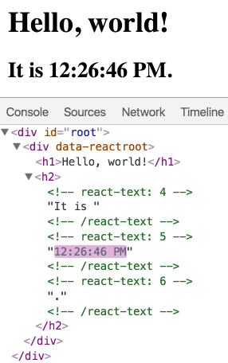

Элементы — мельчайшие кирпичики React-приложениях.

Элемент опысывает то, что вы хотите увидеть на экране:

```js
const element = <h1>Hello, world</h1>;
```

В отличии от DOM-элементов, элементы React — это простые объекты, не отнимающие много ресурсов. React DOM обновляет DOM, чтобы он соотвествовал элементам React.

>**Примечание:**
>
>Элементы можно перепутать с более известной концепцией "компонентов". С компонентами мы ознакомимся в [следующей главе](/docs/components-and-props.html). Элементы — это то, "из чего сделаны" компоненты, и мы рекомендуем вам дочитать эту главу, прежде чем двигаться дальше.

## Как отрисовать элемент в DOM {#rendering-an-element-into-the-dom}

Дапустим, в вашем HTML-файле есть `<div>`:

```html
<div id="root"></div>
```

Мы называем его "корневым" узлом DOM, так как всё, что находится в нём, будет управляться React DOM. 

Обычно в приложения, написанных польностью на React, есть только один единственный корневой элемент. Если вы хотите использовать React в существующем приложении, то вы можете создать столько независимых корневых элементов, сколько посчитаете нужным.

Чтобы отрисовать React-элемент в корневой узел DOM, вызовите `ReactDOM.render()` с React-элементом и корневым DOM узлом в качестве аргументов:

`embed:rendering-elements/render-an-element.js`

[](codepen://rendering-elements/render-an-element)

На странице будет написано "Hello, world".

## Обновление отрисованных элементов {#updating-the-rendered-element}

Элементы React [иммутабельны](https://ru.wikipedia.org/wiki/%D0%9D%D0%B5%D0%B8%D0%B7%D0%BC%D0%B5%D0%BD%D1%8F%D0%B5%D0%BC%D1%8B%D0%B9_%D0%BE%D0%B1%D1%8A%D0%B5%D0%BA%D1%82). После создания элемента, нельзя изменить его потомков или аттрибуты. Элемент похож на единичный кадр в фильме: он отразает состояние интерфейса в конкретный момент времени.

Пока что, мы знаем только один способ обновить интерфейс — это создать новый элемент и передать его в `ReactDOM.render()`.

Рассмотрим пример с часами:

`embed:rendering-elements/update-rendered-element.js`

[](codepen://rendering-elements/update-rendered-element)

В примере выше `ReactDOM.render()` вызывается каждую секунду с помощью колбэка [`setInterval()`](https://developer.mozilla.org/en-US/docs/Web/API/WindowTimers/setInterval)

>**Примечание:**
>
>На практике, большинство React-приложений вызывают `ReactDOM.render()` только один раз. В следующем разделе вы узнаете как создать [компонент с состоянием](/docs/state-and-lifecycle.html).
>
>Мы рекомендуем не пропускать разделы, поскольку в них используется информация из предыдущих разделов.

## React обновляет только то, что необходимо {#react-only-updates-whats-necessary}

React DOM сравнивает элемент и его потомков с отображаемым на странице и вносит в DOM только те изменения, которые необходимы, чтобы на странице оказался новый элемент.

Вы можете убедиться в этом на [последнем примере](codepen://rendering-elements/update-rendered-element) с помощью инструментов разработчика в браузере:



Несмотря на то, что мы создаем элемент, описывающий все дерево пользовательского интерфейса, каждую секунду React DOM изменяет только текстовый узел, содержимое которого изменилось.

Наш опыт подсказывает, что при реализации изменений в интерфейсе возникает много ошибок. Их можно избежать, если думать о том, как должно выглядеть приложение, а не как внести изменения.
